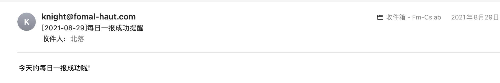

  

# 上海大学每日一报

减轻负担，反内卷！

## 前言

关于每日一报，网上已经有了很多版本，一开始做的是使用cookie进行操作，自捷报被点名，挂了之后，就改成了简易版session操作。

## 特点

- [x] 模块划分清晰
- [x] 历史补报
- [x] 自由配置报送信息
- [x] 多用户报送(可选)
- [x] 邮件提醒(可选)

## 代码结构

```shell
├── README.md
├── media/
├── config/							
│   ├── __init__.py
│   ├── autoreport.conf # 配置文件
├── log/
│   └── report.log     # 日志文件
├── main.py            # 主程序
└── src/               
    ├── encrypt/           # 解密
    ├── fstate/		   # fstate生成器
    ├── login/		   # 登录器
    ├── mail/		   # 邮件发送器
    └── report/		   # 报送器
```

## 配置文件说明

```shell
[user:Leo]         # 用户，格式：[user:昵称]
realname = 李华     # 姓名
username = 18765432 # 学号
password = 123456789 # 密码
report_type = once   # 报送类型:每日一报once/两报twice，因为目前没有使用过两报，没有写，有需求再加
history_report_begin_date = 2021-08-01 # 若不需历史补报，此项不填
email_address = 123456789@qq.com       # 报送成功邮件提醒收件人email地址
email_type = html						# 邮件提醒类型:html/text
success_email = True					# 是否开启邮件报送提醒
in_shanghai = True						# 当日是否在上海
in_school = True						# 当日是否在校
current_address_province = 上海		   # 当天所在省 
current_address_city = 上海市			 # 当天所在市
current_address_region = 宝山区		# 当日所在区
current_address_detail = 校内XX楼		# 具体地址
is_family_address = False			# 是否家庭住址

[email] # 全局配置，新增用户时，无需新增
smtp_server = smtp.exmail.qq.com		# 邮件服务器地址，示例为腾讯企业邮箱
username = knight@fomal-haut.com		# 邮箱账户
password = sddfsdqfdjUwdvsa				# 邮箱授权码

success_subject = 每日一报成功提醒      # text邮件提醒主题
success_text = 今天的每日一报成功啦!	  # text类型邮件提醒正文

```

- 若新增报送用户，在配置文件中新增[user:昵称]，如：[user:Bob],具体内容与示例中Leo用户的配置类似。

- 若需要历史补报，请填写history_report_begin_date，格式如：2021-08-01。

- 若需要开启报送邮件提醒，设置success_email = True，否则为False。

- 邮件提醒设置了两种类型，html和text

  - html格式邮件示例如下，用户可在success_email.html文件中自行进行更改:

  
  - text格式邮件示例如下，用户可自行在配置文件中配置success_subject和success_text：

    

## 使用

```
git clone https://github.com/FomalHauts/SHU_SelfReport
cd SHU_SelfReport
pip install -r requirements.txt
pyhton main.py
```

## 联系
若有任何疑问，请联系:knight@fomal-haut.com


